  

  
  
  
  
  

 

Senior frontend engineer at Appswave, building government digital platforms for clients across the UAE and Saudi Arabia. React, Next.js and TypeScript on the front, bilingual Arabic / English interfaces, left-to-right or right-to-left as the client needs. Going deeper on .NET so I can own a feature end to end.

- **Every build I ship scores 100 / 100 / 100 / 100 in Lighthouse**, mobile and desktop. Nothing is done below that.
- **I audit the supplied design for WCAG AA contrast before it reaches users**, and each README lists what failed and the smallest colour step that fixed it.
- **Top-ranked code reviewer on Frontend Mentor**: Mentor of the Week five times in first place and once in second, plus Mentor of the Month, voted by the developers whose code I reviewed. Still going.

 

## Featured work

<table>
  <tr>
    <th align="left">Project</th>
    <th align="left">What it proves</th>
    <th align="left">Stack</th>
    <th align="left">Links</th>
  </tr>
  <tr>
    <td><b>todo</b></td>
    <td>Offline-first task list synced across devices. localStorage is the source of truth and the app works with no backend; a .NET API replaces the snapshot per list, rate-limited 60/min, RFC 7807 errors, health probe with a DB check. Drag, touch and keyboard reordering.</td>
    <td>Next.js · .NET 9 minimal API · EF Core · PostgreSQL · Docker · Cloudflare + Render</td>
    <td><a href="https://todo-app.abdelrhman-ahmed8881.workers.dev">Live</a> · <a href="https://github.com/MrBlackvanta/todo-app">Code</a></td>
  </tr>
  <tr>
    <td><b>devjobs</b></td>
    <td>Job board where search, filtering and paging run in the database query, not in the browser. Filters survive a reload, load-more paging, light and dark, view transitions.</td>
    <td>Next.js (OpenNext) · .NET minimal API · EF Core · SQLite · Cloudflare + Render</td>
    <td><a href="https://devjobs-web-app.abdelrhman-ahmed8881.workers.dev">Live</a> · <a href="https://github.com/MrBlackvanta/devjobs-web-app">Code</a></td>
  </tr>
  <tr>
    <td><b>rest-countries</b></td>
    <td>Server-rendered Next.js on Cloudflare's edge over an ASP.NET Core API I built instead of the public one. Search, region filter, detail pages, theme switcher.</td>
    <td>Next.js SSR · ASP.NET Core · EF Core · Cloudflare Workers</td>
    <td><a href="https://rest-countries-api-with-color-theme-switcher.abdelrhman-ahmed8881.workers.dev">Live</a> · <a href="https://github.com/MrBlackvanta/rest-countries-api-with-color-theme-switcher">Code</a></td>
  </tr>
  <tr>
    <td><b>ip-address-tracker</b></td>
    <td>Geolocation lookup proxied through a same-origin Worker, so the API key never ships to the browser. Rate-limited, and a plain visit is resolved at the edge for free so only typed queries spend from the monthly quota.</td>
    <td>TypeScript · Cloudflare Workers · Leaflet</td>
    <td><a href="https://ip-address-tracker.abdelrhman-ahmed8881.workers.dev">Live</a> · <a href="https://github.com/MrBlackvanta/ip-address-tracker">Code</a></td>
  </tr>
</table>

<a href="https://abdelaal.dev/portfolio">All 38 case studies →</a>

 

## Stack

  

Also in daily use: Liferay DXP (client extensions, React widgets), OpenNext, EF Core, Render.

